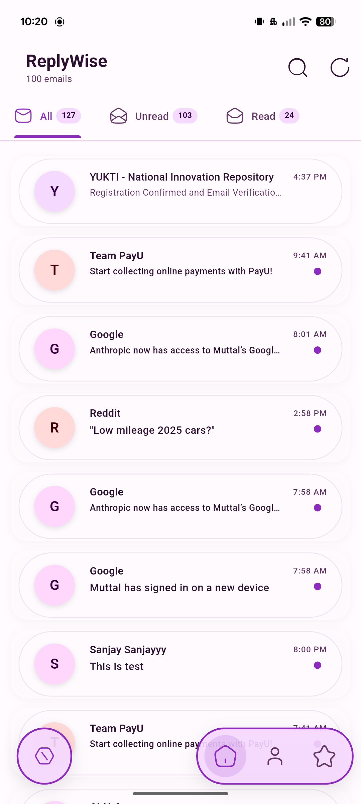
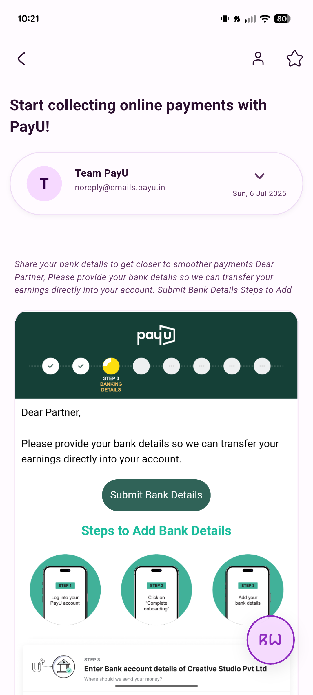
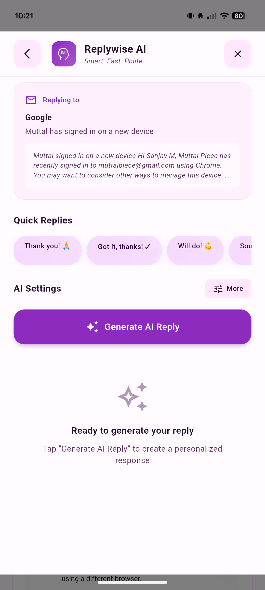

# ReplyWise

## Contents
- [Features](#-features)
- [Tech Stack](#️-tech-stack)
- [Installation](#-installation)
- [Usage](#-usage)
- [Innovation Highlights](#-innovation-highlights)
- [Recognition & Support](#-recognition--support)
- [Demo](#-demo)
- [Contribution](#-contribution)
- [License](#-license)
- [Contact](#-contact)
- [Resources](#-resources)

**AI-Powered Smart Email Management and Reply Generation Platform**

ReplyWise is an innovative Flutter-based application that leverages advanced AI to help users manage, prioritize, and respond to emails efficiently. Designed for professionals and organizations facing email overload, ReplyWise integrates seamlessly with Gmail to provide intelligent triage, context-aware reply suggestions, and productivity-focused tools.

---

## 🚀 Features

- **AI-Powered Reply Suggestions:** Generate smart, context-aware replies using advanced natural language processing.
- **Automatic Email Organization:** Categorize emails by importance, unread status, and personal relevance.
- **Summarization:** Get concise summaries of lengthy email threads.
- **Customizable Quick Replies:** Save and use personalized quick reply templates.
- **One-Click Gmail Integration:** Reply directly from the app with seamless Gmail connectivity.
- **Advanced Filtering:** Filter emails by importance, unread, attachments, and more.
- **Attachment Handling:** View, download, and manage email attachments.
- **Signature Customization:** Personalize your email signatures for different accounts.
- **Privacy-Focused:** No server-side email storage; all processing is local or via secure APIs.
- **Modern, Intuitive UI:**  
  - Clean, minimal, and distraction-free layouts  
  - Animated transitions and smooth navigation  
  - Responsive design for all devices  
  - Customizable color themes and accent colors  
  - Material 3 and Neumorphic design elements  
  - Interactive cards and swipe actions  
  - Floating action buttons for quick actions  
  - Collapsible side menu and bottom navigation bar  
  - Rich text email viewer with inline images and attachments  
  - Profile avatars and dynamic status indicators  
  - Progress bars for loading and sync states  
  - Tooltips and onboarding walkthroughs  
  - Lottie animations for empty states and notifications  
- **Multi-Account Support:** Manage multiple Gmail accounts from a single dashboard.
- **Dark Mode:** Reduce eye strain with a fully supported dark theme.
- **Notifications:** Get real-time notifications for important emails.
- **Draft Management:** Save, edit, and send AI-generated drafts.
- **Productivity Analytics:** Visualize your email habits and response times with interactive charts and graphs.

---

## 🛠️ Tech Stack

- **Frontend:** Flutter (Dart)
- **Backend/AI:** Integration with ReplyWise AI API (no server-side email storage)
- **Email Integration:** Gmail API (OAuth 2.0)
- **State Management:** Provider / Riverpod (customizable)
- **Other:** RESTful APIs, Secure Storage, Responsive Design

---

## 📦 Installation

1. **Clone the repository:**
   ```bash
   git clone https://github.com/yourusername/replywise.git
   cd replywise
   ```

2. **Install dependencies:**
   ```bash
   flutter pub get
   ```

3. **Configure Gmail API:**
   - Set up a Google Cloud project and enable Gmail API.
   - Download `credentials.json` and place it in the project directory.
   - Update OAuth redirect URIs as per Flutter platform (web, mobile, desktop).

4. **Run the app:**
   ```bash
   flutter run
   ```

---

## 📝 Usage

- **Sign in** with your Gmail account.
- **Browse** your inbox with smart filters and categories.
- **Enjoy a visually rich dashboard** with animated cards, avatars, and color-coded labels.
- **Select** an email to view AI-generated summaries and reply suggestions in a modern, card-based layout.
- **Choose** a suggested reply, edit if needed, and send with one click.
- **Customize** quick replies and signatures in settings, with live previews.
- **Switch** between accounts and manage notifications from a sleek side menu.
- **Track your productivity** with built-in analytics and beautiful charts.

---

## 🎯 Innovation Highlights

- **Deep Context Understanding:** AI analyzes email threads for more relevant replies.
- **Customizable AI Tone & Length:** Adjust reply style to suit your communication.
- **No Cloud Email Storage:** Your emails remain private and secure.
- **Productivity Focus:** Tools to reduce email fatigue and improve response times.

---

## 🏆 Recognition & Support

- **Developed as part of:** Academic Innovation Project / Startup Initiative
- **Academic Year:** 2023-2024
- **Incubation Support:** [Your Incubation Unit Name Here]
- **IP/Patent:** No
- **Grants/Seed Fund:** No
- **Commercialization:** No

---

## 📺 Demo

- **Video:**  
  <video src="contens./replaywise.mp4" controls width="600"></video>

- **Screenshots:**  

<table>
  <tr>
    <td align="center"><br><b>Inbox Overview</b></td>
    <td align="center"><br><b>Email Overview</b></td>
  </tr>
  <tr>
    <td align="center"><br><b>Email Summarization</b></td>
  </tr>
</table>

---

## 🤝 Contribution

Contributions are welcome! Please open issues or submit pull requests.

1. Fork the repository.
2. Create your feature branch (`git checkout -b feature/YourFeature`).
3. Commit your changes (`git commit -am 'Add new feature'`).
4. Push to the branch (`git push origin feature/YourFeature`).
5. Open a pull request.

---

## 📄 License

This project is licensed under the MIT License. See [LICENSE](LICENSE) for details.

---

## 📬 Contact

- **Email:** [your.email@example.com]
- **LinkedIn:** [Your LinkedIn]
- **Website:** [Your Website]

---

## 📚 Resources

- [Flutter Documentation](https://docs.flutter.dev/)
- [Gmail API Docs](https://developers.google.com/gmail/api)
- [ReplyWise AI API Docs](#) <!-- Update with actual API docs link if available -->

---

> **ReplyWise** – Making email smarter, faster, and stress-free.
